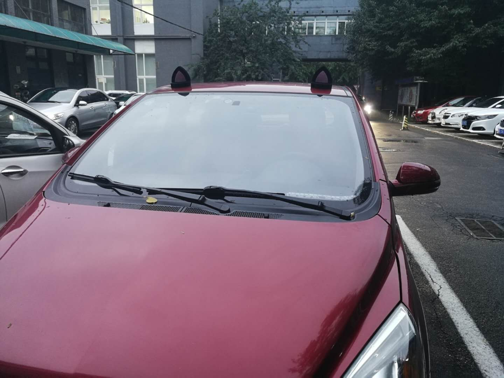

### 9月23散记

就像鹏博说的一样，今天是个暴雨天，就算是带了伞，穿了高底篮球鞋，最后到公司还是湿漉漉了

刚来北京的时候就想过如果遇到了雨天我上下班会不会很不方便，现实告诉了我： 是的 不仅不方便 还特别的难受，因为脚很黏:cry:

but上班路上有看到令强迫症难受的井盖:grinning:

下班看到有猫耳朵的车子:cat:

听着耳机的歌，缓慢的骑着车，每天下班的这个时候就是最舒服的时候吧，一个人的世界还真的挺好

谈什么恋爱 别人喜欢的是历史好的男生 你们不是一路人