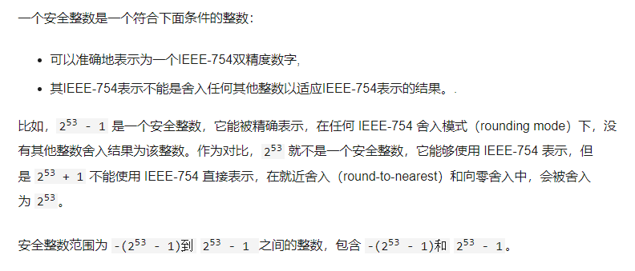
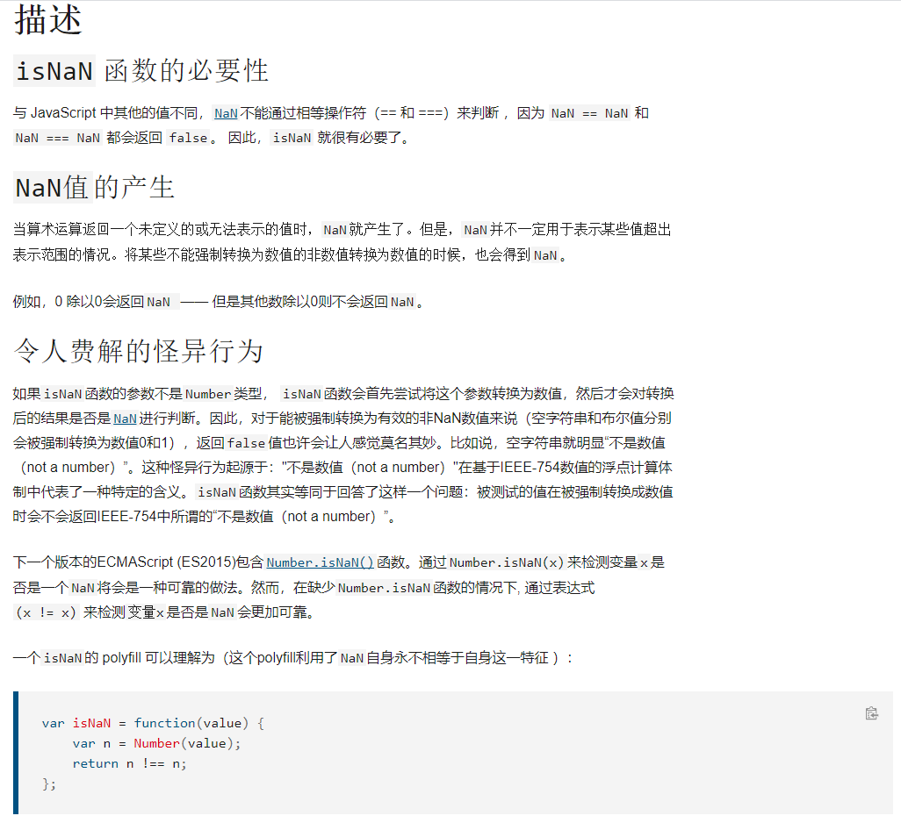

# ES 2015(ES6) 复习总结 part2

## String.includes()

includes()方法用于判断一个字符串是否包含在另一个字符串内，根据情况返回true或false

includes()是区分大小写的。

```javascript
'Blue Whale'.includes('blue'); // returns false
```

兼容补丁：

```javascript
if (!String.prototype.includes) {
  String.prototype.includes = function(search, start) {
    'use strict';
    if (typeof start !== 'number') {
      start = 0;
    }

    if (start + search.length > this.length) {
      return false;
    } else {
      return this.indexOf(search, start) !== -1;
    }
  };
}
```


```javascript
//举例
var str = 'To be, or not to be, that is the question.';

console.log(str.includes('To be'));       // true
console.log(str.includes('question'));    // true
console.log(str.includes('nonexistent')); // false
console.log(str.includes('To be', 1));    // false
console.log(str.includes('TO BE'));       // false
```


## String.startWith() & String.endsWith()

### startWith()

startsWith()用来判断当前字符串是否以另外一个给定的子字符串开头，并根据判断结果返回true 或false

第一个参数为要搜索的字符串，第二个参数为第一个参数开始的位置，默认为0

兼容补丁：

```javascript
if (!String.prototype.startsWith) {
    Object.defineProperty(String.prototype, 'startsWith', {
        value: function(search, pos) {
            pos = !pos || pos < 0 ? 0 : +pos;
            return this.substring(pos, pos + search.length) === search;
        }
    });
}
```


举例

```javascript
var str = "To be, or not to be, that is the question.";

alert(str.startsWith("To be"));         // true
alert(str.startsWith("not to be"));     // false
alert(str.startsWith("not to be", 10)); // true
```

### endsWith

endsWith()用来判断当前字符串是否是以另外一个给定的子字符串”结尾“，根据判断结果返回true或false

第一个参数为要搜索的子字符串，第二个参数作为要检验的字符串的长度（从头开始计算）


兼容：

```javascript
if (!String.prototype.endsWith) {
	String.prototype.endsWith = function(search, this_len) {
		if (this_len === undefined || this_len > this.length) {
			this_len = this.length;
		}
		return this.substring(this_len - search.length, this_len) === search;
	};
}
```


举例

```javascript
var str = "To be, or not to be, that is the question.";

alert( str.endsWith("question.") );  // true
alert( str.endsWith("to be") );      // false
alert( str.endsWith("to be", 19) );  // true
```


## 与Array有关的新方法

### Array.from()

Array.from() 方法从一个类似数组或可迭代对象创建一个新的，浅拷贝的数组实例。

```javascript
console.log(Array.from('foo'));
// expected output: Array ["f", "o", "o"]

console.log(Array.from([1, 2, 3], x => x + x));
// expected output: Array [2, 4, 6]
```


使用语法： Array.from(arrayLike[, mapFn[, thisArg]])

第一个参数为 arrayLike。为想要转换成数组的伪数组对象或可迭代对象

第二个参数mapFn可选， 如果指定了该参数，新数组中的每个元素会执行该回调函数

第三个参数thisArg可选。 执行回调函数mapFn时的this对象

返回值为一个新的`数组实例` 


```javascript
//从String生成数组
Array.from('foo');// [ "f", "o", "o" ]

//从Set生成数组
const set = new Set(['foo', 'bar', 'baz', 'foo']);
Array.from(set);// [ "foo", "bar", "baz" ]

//从Map生成数组
const map = new Map([[1, 2], [2, 4], [4, 8]]);
Array.from(map);// [[1, 2], [2, 4], [4, 8]]

const mapper = new Map([['1', 'a'], ['2', 'b']]);
Array.from(mapper.values());// ['a', 'b'];

Array.from(mapper.keys());// ['1', '2'];

//在Array.from()中使用箭头函数
```


数组去重合并

```javascript
function combine(){
    let arr = [].concat.apply([], arguments);  //没有去重复的新数组
    return Array.from(new Set(arr));
}

var m = [1, 2, 2], n = [2,3,3];
console.log(combine(m,n));                     // [1, 2, 3]
```


### Array.keys()

 `keys() `方法返回一个包含数组中每个索引键的`Array Iterator`对象。


举例

```javascript
var arr = ["a", , "c"];
var sparseKeys = Object.keys(arr);
var denseKeys = [...arr.keys()];
console.log(sparseKeys); // ['0', '2']
console.log(denseKeys);  // [0, 1, 2]
```


### Array.find()

 `find()` 方法返回数组中满足提供的测试函数的`第一个元素`的值。否则返回 [`undefined`](https://developer.mozilla.org/zh-CN/docs/Web/JavaScript/Reference/Global_Objects/undefined)。

```javascript
const array1 = [5, 12, 8, 130, 44];

const found = array1.find(element => element > 10);

console.log(found);
// expected output: 12
```


使用方法： arr.find(callback[, thisArg])

callback: 在数组每一项上执行的函数，接受三个参数（ element: 当前遍历到的元素；index(可选)：当前遍历到的索引；array(可选）: 数组本身）

thisArg(可选)：执行回调时用作this的对象


find对数组中每一项元素执行一次callback，所以复杂度还是很高的。

find方法不会改变数组


举例

```javascript
var inventory = [
    {name: 'apples', quantity: 2},
    {name: 'bananas', quantity: 0},
    {name: 'cherries', quantity: 5}
];

function findCherries(fruit) {
    return fruit.name === 'cherries';
}

console.log(inventory.find(findCherries)); // { name: 'cherries', quantity: 5 }
```


```javascript
//  寻找数组中的质数
function isPrime(element, index, array) {
  var start = 2;
  while (start <= Math.sqrt(element)) {
    if (element % start++ < 1) {
      return false;
    }
  }
  return element > 1;
}

console.log([4, 6, 8, 12].find(isPrime)); // undefined, not found
console.log([4, 5, 8, 12].find(isPrime)); // 5
```


### Array.findIndex()

`findIndex()`方法返回数组中满足提供的测试函数的第一个元素的**索引**。若没有找到对应元素则返回-1。


使用方法： arr.findIndex(callback[, thisArg])

callback: 在数组每一项上执行的函数，接受三个参数（ element: 当前遍历到的元素；index(可选)：当前遍历到的索引；array(可选）: 数组本身）

thisArg(可选)：执行回调时用作this的对象


例子

```javascript
//查找数组中首个质数元素的索引
function isPrime(element, index, array) {
  var start = 2;
  while (start <= Math.sqrt(element)) {
    if (element % start++ < 1) {
      return false;
    }
  }
  return element > 1;
}

console.log([4, 6, 8, 12].findIndex(isPrime)); // -1, not found
console.log([4, 6, 7, 12].findIndex(isPrime)); // 2


```


## New Math Methods

### Math.trunc()

将数字的小数部分去除，只保留整数部分。不管参数是正数还是负数，仅仅是删除掉数字的小数部分和小数点

传入该方法的参数会被隐式转换成数字类型

```javascript
Math.trunc(13.37)    // 13
Math.trunc(42.84)    // 42
Math.trunc(0.123)    //  0
Math.trunc(-0.123)   // -0
Math.trunc("-1.123") // -1
Math.trunc(NaN)      // NaN
Math.trunc("foo")    // NaN
Math.trunc()         // NaN
```

### Math.sign()	

返回一个数字的符号 ，指示数字是正数  负数 还是  零

此函数共有5种返回值, 分别是 **1, -1, 0, -0, NaN.** 代表的各是**正数, 负数, 正零, 负零, NaN**。

传入该函数的参数会被**隐式转换**成数字类型。

```javascript
Math.sign(3);     //  1
Math.sign(-3);    // -1
Math.sign("-3");  // -1
Math.sign(0);     //  0
Math.sign(-0);    // -0
Math.sign(NaN);   // NaN
Math.sign("foo"); // NaN
Math.sign();      // NaN
```

### Math.cbrt()

`**Math.cbrt()**` 函数返回任意数字的立方根.

cbrt 是 "cube root" 的缩写, 意思是立方根.

```javascript
Math.cbrt(NaN); // NaN
Math.cbrt(-1); // -1
Math.cbrt(-0); // -0
Math.cbrt(-Infinity); // -Infinity
Math.cbrt(0); // 0
Math.cbrt(1); // 1
Math.cbrt(Infinity); // Infinity
Math.cbrt(null); // 0
Math.cbrt(2);  // 1.2599210498948734
```

### Math.log2()

`**Math.log2()**` 函数返回一个数字以 2 为底的对数.

如果传入的参数小于 0, 则返回 `NaN`.

```javascript
Math.log2(2)     // 1
Math.log2(1024)  // 10
Math.log2(1)     // 0
Math.log2(0)     // -Infinity
Math.log2(-2)    // NaN
Math.log2("1024")// 10
Math.log2("foo") // NaN
```

### Math.log10()

`**Math.log10()**` 函数返回一个数字以 10 为底的对数.

如果传入的参数小于 0, 则返回 NaN.

```javascript
Math.log10(10)   // 1
Math.log10(100)  // 2
Math.log10("100")// 2
Math.log10(1)    // 0
Math.log10(0)    // -Infinity
Math.log10(-2)   // NaN
Math.log10("foo")// NaN
```


## New Number Properties & New Number Methods

### EPSILON

**`Number.EPSILON`** 属性表示 1 与[`Number`](https://developer.mozilla.org/zh-CN/docs/Web/JavaScript/Reference/Global_Objects/Number)可表示的大于 1 的最小的浮点数之间的差值。

EPSILON属性的值接近 2.2204460492503130808472633361816E-16 或   2的-52次方

EPSILON的特性： writable : false,  enumerable: false, configurable: false

### MIN_SAFE_INTEGER

**`Number.MIN_SAFE_INTEGER`** 代表在 JavaScript中最小的安全的integer型数字 (`-(2的53次方 - 1)`).

特性同EPSILON特性

```javascript
Number.MIN_SAFE_INTEGER // -9007199254740991
-(Math.pow(2, 53) - 1)  // -9007199254740991
```

### MAX_SAFE_INTEGER

**`Number.MAX_SAFE_INTEGER`** 常量表示在 JavaScript 中最大的安全整数（maxinum safe integer)（`2的53次方 - 1）。`

特性同EPSILON特性

```javascript
Number.MAX_SAFE_INTEGER // 9007199254740991
Math.pow(2, 53) - 1     // 9007199254740991
```

### Number.isInteger()

**`Number.isInteger()`** 方法用来判断给定的参数是否为整数。

```javascript
Number.isInteger(0);         // true
Number.isInteger(1);         // true
Number.isInteger(-100000);   // true

Number.isInteger(0.1);       // false
Number.isInteger(Math.PI);   // false

Number.isInteger(Infinity);  // false
Number.isInteger(-Infinity); // false
Number.isInteger("10");      // false
Number.isInteger(true);      // false
Number.isInteger(false);     // false
Number.isInteger([1]);       // false
```

### Number.isSafeInteger()

**`Number.isSafeInteger()`** 方法用来判断传入的参数值是否是一个“安全整数”（safe integer）。

  

```javascript
Number.isSafeInteger(3);                    // true
Number.isSafeInteger(Math.pow(2, 53))       // false
Number.isSafeInteger(Math.pow(2, 53) - 1)   // true
Number.isSafeInteger(NaN);                  // false
Number.isSafeInteger(Infinity);             // false
Number.isSafeInteger("3");                  // false
Number.isSafeInteger(3.1);                  // false
Number.isSafeInteger(3.0);                  // true
```

## New Global Methods

### isFinite()

该全局 **`isFinite()`** 函数用来判断被传入的参数值是否为一个有限数值（finite number）。在必要情况下，参数会首先转为一个数值。


可以用这个方法来判定一个数字是否是有限数字。`isFinite` 方法检测它参数的数值。如果参数是 `NaN`，正无穷大或者负无穷大，会返回`false`，其他返回 `true`。

```javascript
isFinite(Infinity);  // false
isFinite(NaN);       // false
isFinite(-Infinity); // false

isFinite(0);         // true
isFinite(2e64);      // true, 在更强壮的Number.isFinite(null)中将会得到false


isFinite("0");       // true, 在更强壮的Number.isFinite('0')中将会得到false
```

### isNaN()

`isNaN()` 函数用来确定一个值是否为[`NaN`](https://developer.mozilla.org/zh-CN/docs/Web/JavaScript/Reference/Global_Objects/NaN) 。



```javascript
isNaN(NaN);       // true
isNaN(undefined); // true
isNaN({});        // true

isNaN(true);      // false
isNaN(null);      // false
isNaN(37);        // false

// strings
isNaN("37");      // false: 可以被转换成数值37
isNaN("37.37");   // false: 可以被转换成数值37.37
isNaN("37,5");    // true
isNaN('123ABC');  // true:  parseInt("123ABC")的结果是 123, 但是Number("123ABC")结果是 NaN
isNaN("");        // false: 空字符串被转换成0
isNaN(" ");       // false: 包含空格的字符串被转换成0

// dates
isNaN(new Date());                // false
isNaN(new Date().toString());     // true

isNaN("blabla")   // true: "blabla"不能转换成数值
                  // 转换成数值失败， 返回NaN
```


## JavaScriopt Modules

在ES6 JS引进了模块化。模块化也是很多框架的基本原理，将各种组件封装成模块然后导出。

细节不深究，理解什么是模块即可。

看这个网址查看更详细的有关Modules的内容：[MDN](https://developer.mozilla.org/zh-CN/docs/Web/JavaScript/Guide/Modules) 
