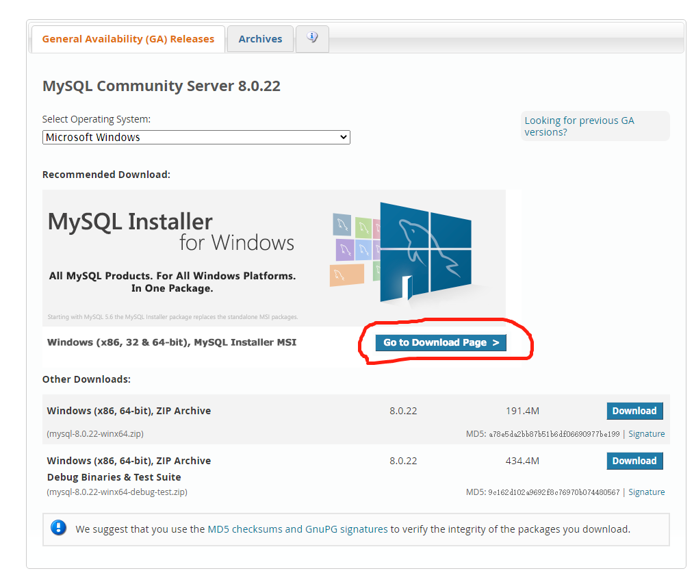
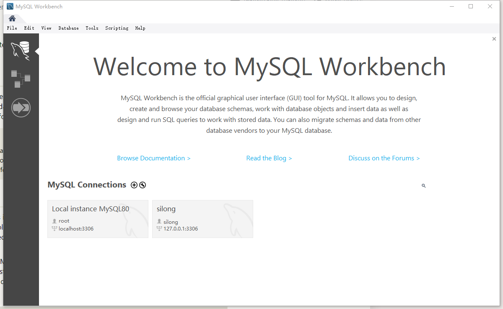

# Mysql+Workbench使用方法

## Mysql通识

既然要用nodejs实现服务端，那数据库以及sql语句肯定是必须要会的（其实阿龙本身就是后端出身，但是阴差阳错做了前端）。

在电脑上下载Mysql的时候，选择那个最全的！

下载路径：进入mysql官网==>DOWNLOADS==>MySQL Community(GPL)Downloads==>MySQL Community Server  然后进入这个页面：

点击那个被框中的按钮，选择那个400+M的一栏进行下载（这个下载很全面，还会包含一个数据库的UI软件WorkBench），基本一路next就可以了(当然端口，ip什么的还是需要你自己进行配置)

## SQL语句

要进行数据库操作肯定是要会sql语句的，不仅仅是要在用户操作页面的时候实现数据库的CRUD，还要预先进行数据库的创建。

基本知识可以参考 [sqlbolt](https://sqlbolt.com/) 更细一些的可以自己Google一下

## WorkBench

打开workbench,(自己搜索一下下载的路径，或者通过搜索找到workbench),进入后一开始应该长这样（没有那个silong数据库）：

点击默认创建的 Local instance MySQL80数据库，会提示让你输入密码（在安装的时候配置的，需要牢记！ 其实稍后也会自己创建一个新的数据库，不记得也无所谓 😄）。进入之后的页面以及操作参考这篇博客：[戳这里](https://www.jb51.net/article/163495.htm) 

## express连接mysql数据库

配置mysql连接基本数据的时候，需要知道这些信息：

host

port

user

password

database

host一般来说都是loacalhost(或者127.0.0.1)，mysql的port大多都是3306，user就是用户名，password是自己设的密码，database是输入密码之后再进行创建的某个数据库