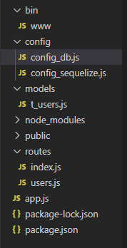
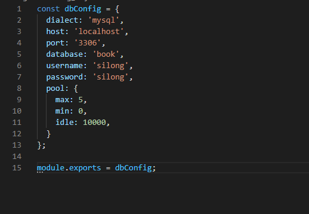
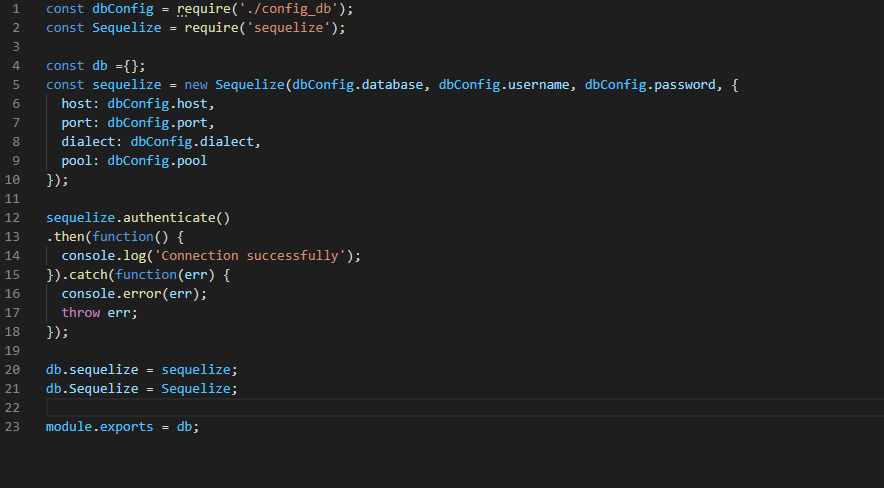
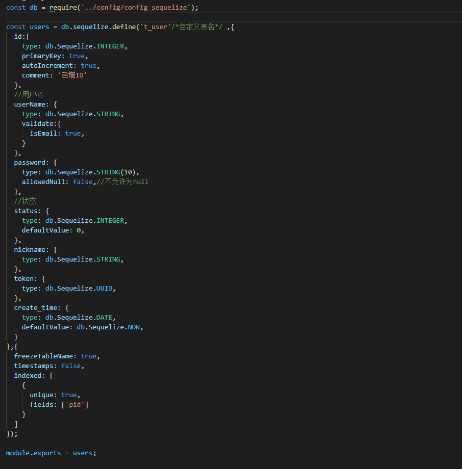
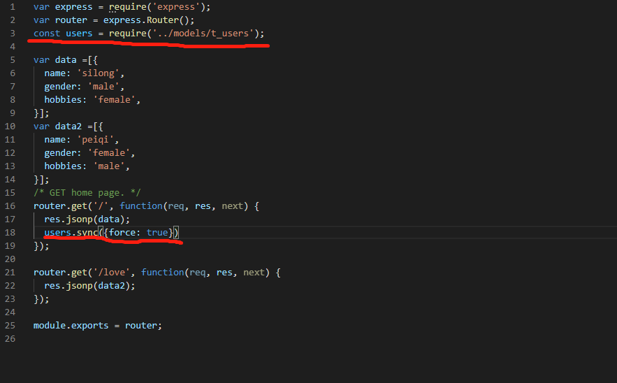
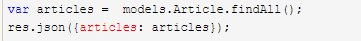
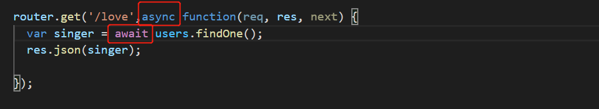

# Nodejs传递数据库数据给前端实现前后端分离开发

## MySQL+Sequelize

### 什么是MySQL&Sequelize

MySQL是数据库，Sequelize是数据库的一个使用工具。

Sequelize可以连接很多数据库，sqlite，mysql，mariadb等等，我们这个项目下使用的是MySQL

在使用Sequelize之前，最好要对数据库的各种操作都有个基本的认识，增删改查，ORM的功能，数据表和数据表之间的关联 等等都需要了解。

### 为什么要使用Sequelize

现在哪有人做后端开发还直接通过原生的数据库和开发语言进行连接呢，java都有mybatis，nodejs肯定也会有简化的工具嘛。Sequelize就是nodejs中的数据库的简化工具。它让我们更方便的实现了常见的操作数据库的方式：后端创建实例和数据库连接（映射，ORM），通过修改实例来修改数据库，而不是愚蠢的直接修改数据库里面的数据。

### Sequelize的使用

看了一下Sequelize的文档，不算长，但是要吃透还是需要多上手增加熟练度。

我们一步一步来，先实现Sequelize操作数据库。等后端和数据库的操作弄熟练了，再考虑前端和数据的交互。

#### Sequelize的基本配置

通过npm下载安装Sequelize 以及mysql2 （sequelize不用mysql，按理来说mysql 和 mysql2是可以兼容的，但是如果你在已经下载了mysql的情况下安装mysql2失败，那就先把mysql删除掉吧）。（这里的mysql不是在浏览器上下载的mysql，指的是通过npm下载的mysql,可以早node_module里查看是否有下载mysql这个包）

`npm install sequelize --save`

`npm install mysql2 --save`

#### Sequelize模块化封装

在根目录创建一个config文件夹，用以存放数据库和config_sequelize的基本信息：

在config_db.js中配置连接数据库的时候需要的参数，并且export出去（这个文件只会在另一个sequelize配置文件中引入）：


然后在config_sequelize.js中通过sequelize进行数据库连接：

（我把Sequelize 和 sequelize都封装到一个对象里面 然后暴露出去了。其实也可以不这么写，反正`require('sequelize')`在哪都是可以的）  记得要区分Sequelize 和 sequelize（第一个S字母大小写不同）,Sequelize是sequelize这个组件，sequelize是用以连接数据库的对象

接下来就可以进行实例操作了

#### 实例的配置和使用

实例在sequelize就对应java中的bean，可以理解为数据库中数据的映射，因为直接操作数据库是不安全的，所以我们先操作实例，然后通过实例来更新数据库中的数据。


在根目录下创建一个models文件夹，里面用来存放实例文件。

每个实例其实对应的是数据库中的一个表。我们在实例里面把表设计好，然后可以直接在数据库中生成表。

表生成好了之后，我们就可以调用sequelize里面的方法进行CRUD操作。我的习惯是在routes文件夹下的文件里面，引入实例文件然后在接口处实现CRUD：

在接口的地方我们还可以通过 users.create在表中添加数据 ，也可以通过users.findAll查找到数据库中的数据 还可以实现修改等等操作，具体的方法，查看sequelize文档就会有足够的了解了：[戳这里](https://www.sequelize.com.cn/core-concepts/model-instances) 

（接口怎么写 我在这里就不赘述了，我在另外一篇博客里面专门写过实现接口的方法，感兴趣的可以查看我的那篇博客）

### 获取数据库数据并通过res返回给前端

2020.11.4更新

阿龙在这个地方踩到了非常多的坑，遇到了  没有模板错误   ，请求一直处于pending状态 等一系列错误，让我们来慢慢解决吧

首先，我们需要还原一个东西，就是原先使用express创建的项目中有个view文件夹，我们不删它，保留在那里（虽然不会使用到），并且app.js中有关模板的语句也不要注释掉，否则会遇到一个 没有模板的错误（上网找还tm的找不出来原因）。（阿龙一开始认为既然是前后端分离开发，那么这个模板也就没有了用处所以就把它删了，并且app.js里面的配置语句也注释掉了，导致我浪费了2天的时间！！）


接下来我们来进行数据库的增删改查操作！

#### sequelize增删改查和传统sql语句的不同

有过数据库使用经验的朋友应该知道，传统的操作数据库的方式是通过sql语句来实现的  比如  select * from table , update ....., create.....

使用习惯了的话可能觉得还好，但是实际上操作以及维护起来挺麻烦的。而且既然我们已经使用了sequelize，那么我们就用sequelize里面操作数据库的方法吧！文档请看官网，CRUD语句我在这就不讲了！ [戳这里](https://www.sequelize.com.cn/core-concepts/model-querying-basics) 


#### 在接口中实现增删改查的方法

**这个点很重要**

1. 因为sequelize调用接口是使用promise的方法，所以我们可以通过事务逻辑进行调用：

```javascript
router.get('/love', function(req, res, next) {
  users.findOne()
  .then(singer => {
    res.json(singer);
  }).catch({
  })
});
```

也就是需要then  catch进行调用，并且（！） 返回数据需要写在then方法里面，否则得到的会是一个空的对象

 

 2.有些同学就好奇，那可不可以写成常见的 将语句复制个一个变量，然后res.json()调用这个变量实现数据传递呢，就像这样：

 

当然是可以的，但是使用这个方法需要解决一个错误：你这样调用得到的是Promise对象，不是数据库中的数据，所以前端得到的结果是空的。你需要将自己的接口改成异步的，像这样：

--`async`  是 异步 的意思， `aysnc function` 表明当前的  function 是异步的 

--`await` 表示等待一个异步方法执行。 await 只能在 async函数内部使用，用在普通函数中会报错

使用 async/await 最多的好处就是代码变得干净简洁，可以将原来的 异步js 代码， 改为类似于其他语言  同步  的写法。避免代码中出现一大堆的嵌套回调函数，导致代码难以阅读。


#### tips

无论是增删改查哪个操作，要么使用promise的方法，要么使用async/await 方法，否则会报错或者得到的数据为空。

浏览器只能访问get请求，post请求的接口需要通过postman来调用接口。

前端传递数据给后端和后端传递数据给前端的原理其实是一样的，只不过一个是req，一个是res。（如果需要会另写一篇博客）

console.log()显示数据库实例的时候最好不要直接console.log()实例（sequelize附带很多附加属性），将实例toJSON()然后再console会只得到数据库里面的数据：console.log(users.toJSON())

强烈推荐有关sequelize的文章： [https://www.cnblogs.com/chenxi188/p/13841612.html]( https://www.cnblogs.com/chenxi188/p/13841612.html)  （在文章结尾有上一篇下一篇可以跳转查看）

