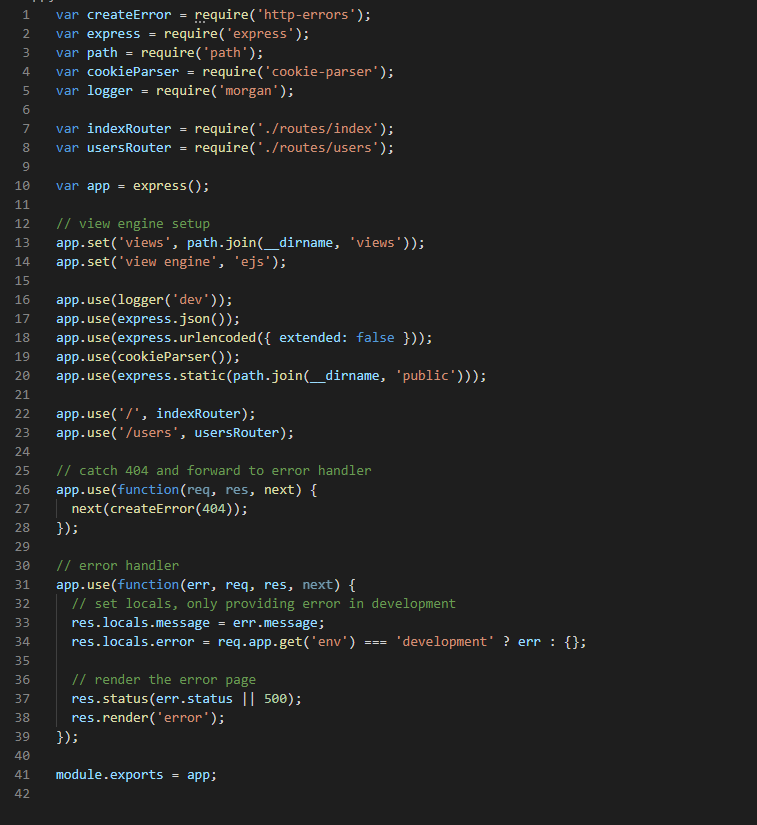

# Nodejs实现服务端功能并且和前端进行交互（vue）

## 开发环境/开发工具

IDE用vscode。

下载安装nodejs

前端：npm安装vue，vuex，vue-cli，vue-router

后端：npm安装express，npm安装express-generator

数据库：mysql，monggoDB 这两个选一个

git工具

## 使用express框架创建后端项目目录

默认已经安装好了`nodejs`和`vscode` (nodejs自带npm)

npm 下载express

npm 下载express-generator

然后在一个想存放项目的目录下新建一个文件夹，用vscode进入这个文件夹，打开terminal (确保是指向这个文件夹)

express -e projectname

-e 是选用一个模板   projectname就是自己给项目起的名字

然后npm install 先将需要的依赖包下载下来。

小功能：使用nodemon替换node进行服务端启动，这样每次保存后端代码的时候会自动更新。

nodemon方法：先npm install nodemon --save    然后再package.json中，将第六行的node 改为nodemon ,保存即可


接下来我们来看一下创建的文件的目录：


别着急，我们一个一个进行解读

### bin/www

我们先来进行一个图的截： 

| 代码范围 | 功能                                                         |
| -------- | ------------------------------------------------------------ |
| 6-8      | 引用express自带的模块（debug,http） 以及  入口文件 app.js    |
| 14-15    | 使用代码范围在35-49所编写的函数 normalizePort() 给定我们服务端的 端口 |
| 21       | 创建一个服务                                                 |
| 27       | 监听端口（端口在代码范围14-15根据函数所给定）                |
| 28-29    | 绑定事件。分别绑定了 出错 以及 成功调用端口 这两种情况下所要进行的事件 |
| 35-49    | 函数normalizePort的逻辑编写。功能：以10为基数进行字符串转为int的解析 |
| 55-77    | 函数onError的逻辑编写。功能：给不同的错误情况 予 不同的处理方式。（不太重要） |
| 83-89    | 函数 onListening的逻辑编写。功能:服务端成功调用http服务的情况下的逻辑。（不太重要，实现了就行，我管他原理呢哼） |

能看懂英文注释的最好不过了

### node_modules

这里面都是需要依赖的包。没什么好说的

### public

这里面大多存储静态文件。前后端分离的项目（`nodejs+express`操作数据，前端操作页面视图）的话不用太过在意

### routes

在这个文件里面写 接口文件（js文件）。后端的路由是由`app.js`中的 `app.use(path, xxxRouter)`方法 和这个文件夹里面的文件进行配合实现的

### views

模板文件。通过express创建的项目大多都会有模板文件，模板文件类型有很多种，jade，ejs等等。

存在的目的：有些很小的项目，根本就不需要前后端分离，分离了反而开发起来更复杂了，所以提供给你模板，直接通过模板生成前端页面。

如果是前后端分离的项目可以直接无视。

### app.js

前端入口文件。最重要的文件。里面的东西最好不要删除。先来个图的截：





| 代码范围 | 功能                                                         |
| -------- | ------------------------------------------------------------ |
| 1-5      | express自带module的引用。（每个引用的功能不了解的自行查看文档哦） |
| 7-8      | 引用 routes文件夹里面的文件。和routes文件夹里面的文件进行配合实现接口的暴露 |
| 10       | 创建express示例。功能都是基于express示例来实现的             |
| 13-14    | 13：指定模板目录  14 指定模板引擎   前后端分离的话可以把这两行注释掉 |
| 16-18    | 目的是支持req.body的传输。这样的话可以在接口里面使用req.body得到请求体的内容 |
| 19-20    | 目的：给了获取cookie的权限（相信你懂我的意思了）             |
| 22-23    | 很重要。 路由接口                                            |
| 26-28    | 处理404错误                                                  |
| 31-39    | 处理错误 （好多好多错误）                                    |
| 41       | 接口向外暴露                                                 |

## 任务梳理

前后端分离开发，使用`nodejs`实现服务端数据层面的处理，传输。使用vue实现客户端的页面交互，页面渲染。

前后端跨域处理。

后端的接口编写。

后端的数据库连接

后端的对象存储（和 java 里面的bean功能差不多）

## 跨域配置

跨域配置可以在前端通过代理转发，也可以通过后端

### 前端代理转发方法

通过`vue-cli`创建了前端项目之后，在根目录创建`vue.config.js`配置文件，然后在里面进行代理配置：`devServer.proxy`

可以查看官方文档学习使用：[戳这里](https://github.com/chimurai/http-proxy-middleware#options)

配置只需要指定下面这几项：

```
  devServer: {
    proxy: {
      "/api": {
        target: "http://127.0.0.1:3000/",
        secure: false,
        changeOrigin: true,
      },
    }
  }
```

详情了解可以查看这个图： 

host 和 port这两项 可以不需要。 `pathRewrite`如果没需要的话也不用写

### 后端添加请求头方法

在后端项目目录的`app.js`文件中，直接将下面的代码添加进去就行

```javascript

app.all('*', function(req, res, next) {
  res.header("Access-Control-Allow-Origin", "*");
  res.header("Access-Control-Allow-Headers", "X-Requested-With");
  res.header("Access-Control-Allow-Methods","PUT,POST,GET,DELETE,OPTIONS");
  res.header("Content-Type", "application/json;charset=utf-8");
  next();
});
```

## 前后端接口编写

这是个重头戏，阿龙在这个地方踩了坑

首先我们先了解，代理其实是可以进行多个代理的，所以可以有 **单代理多接口**以及**多代理多接口** （你的接口总不能只有一个吧，不然那还开发个鬼）

我们先来了解单代理多接口

### 单代理多接口

首先我们要了解一个隐藏的知识点：`/api`是个特殊字段，所以无论是代理转发，还是后端的接口编写，还是`axios`中的`baseURL`的开头都最好是/api

#### 后端的接口编写规则

其实也不是只有这一种方法，只是我用的是这种方法，如果有更好的可以推荐。

在app.js文件中 有`app.use('/', indexRouter)`和`app.use('/users', usersRouter)`这两行代码


这两行代码的意思是，给`indexRouter`和`usersRouter`这两个已经封装好的js文件一个接口调用的入口。启动服务后，可以通过`localhost:3000/` 和 `localhost:3000/users`访问到 routes文件夹下 `index.js` 和`users.js`所定义的接口返回内容。

##### 多级路由编写

现在知道怎么访问接口了，但是只能访问一级接口，那怎么样才能访问像localhost:3000/users/love/like这样的多级路由呢？

以routes下的users.js为例，默认的内容是这样的： 

我们想要实现多级路由，只需要在第一个路由的路径上进行添加，比如现在的users.js里面的get路径是 `/`，我们只需要新建一个router请求，然后修改第一个参数的路径，比如把 `/` 改成`/love`，就可以调用`localhost:3000/users/love`这个接口得到里面的返回内容了。举例： 


注意：在`app.js`里面调用这个封装好的模块所使用的路径是基础路径，也就是说 `app.use('path1', usersRouter)` 里面的`path1`是`users.js`里面所有二级路由的基本，二级路由都是在`localhost:3000/users` 的基础上向后添加字段的。


同理，我们在index.js里面也添加一些数据，实现两个多级路由接口（其实也就是多个多级路由了）

在浏览器上（postman也可以）直接访问这些接口地址，只要得到了预期的数据那么说明后端的接口已经编写好了。

#### 前端部分对后端接口的调用

##### 对`axios`的封装和调用

我通常封装`axios`的方法是在一个js文件中封装好一个`axios`的示例对象，`baseURL`，`requestHeader`等请求头信息在这个`js`文件里面封装。这个文件里面的信息和后端的接口无关： 


然后，在每个功能模块下（因为vue是模块化开发嘛，每个功能肯定是有自己的模块的）新建一个`apiService.js`文件（`apiService`是文件名，随便你改），在里面引用封装好的`axios`实例，然后在`apiService.js`文件里面编写你这个模块里面需要的所有接口，以供将来的vue文件调用.这个文件里面的信息是和后端接口字段有关的，需要对照后端接口来编写：

最后在需要接口的vue文件中引用这个`apiService`文件，然后调用接口拿到数据即可

##### 在`vue`类型文件中调用接口


#### TIPS+总结

前后端接口配合的时候，后端的app.js文件中的 `app.use('/', indexRouter)` 这样的代码的路径统一加上 `/api`，后面的字段根据实际情况来修改。

同样的前端的vue.config.ja文件中代理的地方的标识，也要设为`/api`，，以达到检测到/api这个字段的时候可以进行跨域 的目的

并且，在axios封装文件中的baseURL最好也要设置为/api，这样就不需要在引用axois实例的封装文件(http封装文件)中手动添加  /api 字段了,只需要根据后端给的接口文档进行接口的调用即可。

### 多代理多接口

在这里先给大家提个醒，多代理经常会报404错误，自己也找不到是什么原因:pensive: ，我按照我自己的实际经历和踩坑写的多代理处理，也许不同的人有不一样的bug，如果我的方法对你有帮助那就再好不过了。

首先先看一篇文章，这里面涉及到多代理以及pathRewrite的一些冷知识：[戳这里](https://blog.csdn.net/weixin_43216105/article/details/105844391)   挺重要的，希望可以看完它~

#### 后端的接口编写规则

接口的编写其实都没有什么太大的区别，但是为了跟单代理做个区分，在这里特意将接口前面的两个字段写成一样的：

相同字段：  /api/product

不同字段： version1  和  version2


**多级路由和单代理一样**

#### 前端部分对后端接口的调用

首先需要修改代理：

你可以把target改成不同的地址，比如聪http://127.0.0.1:3000 改成 http://198.124.6.1:8080


然后需要修改axios的封装文件中的baseURL，将多代理里面相同的字段统一给baseURL： 

最后对不同模块的接口，只需要在requestURL中将不同的字段（version1 和 version2） 拼接上去就可以了。


#### TIPS+总结

在修改了接口字段的时候，最好将后端的服务以及前端的服务都重启一遍，（ ctrl + c 然后再npm start）