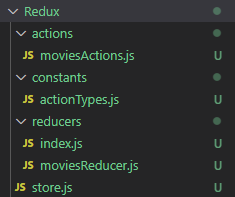
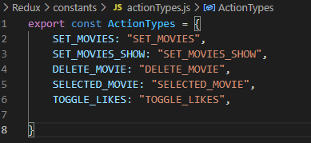
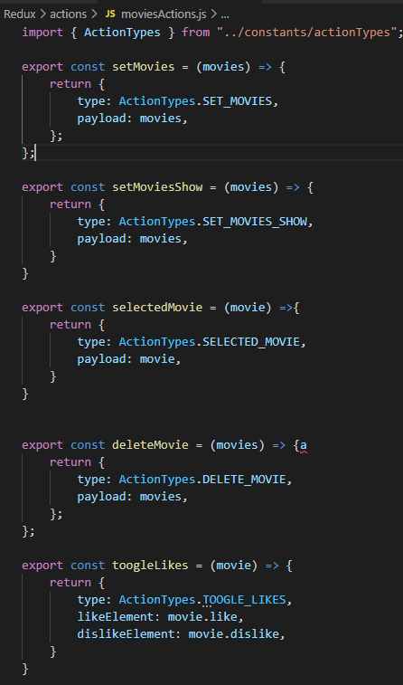
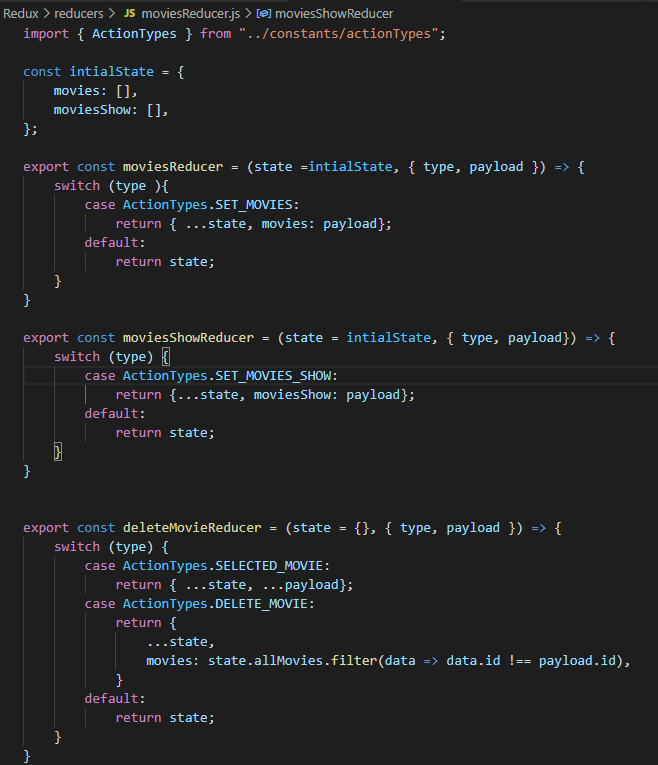
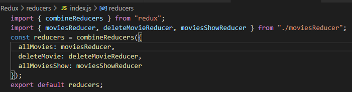
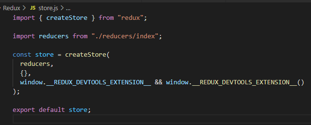

# Redux学习笔记

## 什么时候需要Redux & 什么是Redux & Redux概念梳理 

### 什么是Redux 

Redux是一个状态管理的库，它使用一个称为 ”action“ 的事件来管理和更新应用状态。它以集中式Store的方式对整个应用中使用的状态进行集中管理，其规则确保状态只能以可预测的方式更新。

Redux的更改状态的方式是 Immutability的，也就是说我们不能像以往常见的直接修改数组或者对象的内容：

```javascript
const obj = { a: 1, b: 2 }
// 对外仍然还是那个对象，但它的内容已经变了
obj.b = 3

const arr = ['a', 'b']
// 同样的，数组的内容改变了
arr.push('c')
arr[1] = 'd'
```

而应该使用 复制原先的数组或者对象，并且更新复制体来实现更改。这里需要使用到 spread operator(展开运算符):

```javascript
const obj = {
  a: {
    // 为了安全的更新 obj.a.c，需要先复制一份
    c: 3
  },
  b: 2
}

const obj2 = {
  // obj 的备份
  ...obj,
  // 覆盖 a
  a: {
    // obj.a 的备份
    ...obj.a,
    // 覆盖 c
    c: 42
  }
}

const arr = ['a', 'b']
// 创建 arr 的备份，并把 c 拼接到最后。
const arr2 = arr.concat('c')

// 或者，可以对原来的数组创建复制体
const arr3 = arr.slice()
// 修改复制体
arr3.push('c')
```


### 什么时候需要Redux

个人理解：  当你的项目比较简单，组件和组件之间的信息传递不多的时候，并不太需要使用Redux。 而当项目比较大，项目分成了很多细小的组件，并且每个组件之间需要互相传递状态，共享同一变量的时候，使用Redux就会方便的多。

还有一种说法，因为项目开发到一半再使用Redux也是很容易的，所以在你不知道项目是否需要使用到Redux的时候，可以先不引入Redux，当项目成长到了觉得需要Redux的时候再引入。

### Redux基本概念

#### action(type, payload)  

**action** 是一个具有 `type` 字段的普通 JavaScript 对象。**你可以将 action 视为描述应用程序中发生了什么的事件**.

`type` 字段是一个字符串，给这个 action 一个描述性的名字，比如`"todos/todoAdded"`。我们通常把那个类型的字符串写成“域/事件名称”，其中第一部分是这个 action 所属的特征或类别，第二部分是发生的具体事情。

action 对象可以有其他字段，其中包含有关发生的事情的附加信息。按照惯例，我们将该信息放在名为 `payload` 的字段中。

一个action例子：

```javascript
const addTodoAction = {
  type: 'todos/todoAdded',
  payload: 'Buy milk' //可以只有type没有payload
}
```

####  action creator

**action creator** 是一个创建并返回一个 action 对象的函数。它的作用是让你不必每次都手动编写 action 对象：

```javascript
const addTodo = text => { //在action creator中可以添加参数，更方便的构造action
  return {
    type: 'todos/todoAdded',
    payload: text
  }
}
```

####   reducer

**reducer** 是一个函数，接收当前的 `state` 和一个 `action` 对象，必要时决定如何更新状态，并返回新状态。函数工作过程类似：`(state, action) => newState`。 **你可以将 reducer 视为一个事件监听器，它根据接收到的 action（事件）类型处理事件。** 


Reducer 必需符合以下规则：

- 仅使用 `state` 和 `action` 参数计算新的状态值
- 禁止直接修改 `state`。必须通过复制现有的 `state` 并对复制的值进行更改的方式来做 *不可变更新（immutable updates）*。
- 禁止任何异步逻辑、依赖随机值或导致其他“副作用”的代码

稍后我们将更多地讨论 reducer 的规则，包括为什么它们很重要以及如何正确地遵循它们。

reducer 函数内部的逻辑通常遵循以下步骤：

- 检查 reducer 是否关心这个 action
  - 如果是，则复制 state，使用新值更新 state 副本，然后返回新 state
- 否则，返回原来的 state 不变
- 

下面是 reducer 的小例子，展示了每个 reducer 应该遵循的步骤 (Reducer 可以在内部使用任何类型的逻辑来决定新状态应该是什么，如 `if/else`、`switch`、循环等等。)：

```javascript
const initialState = { value: 0 }

function counterReducer(state = initialState, action) {
  // 检查 reducer 是否关心这个 action
  if (action.type === 'counter/increment') {
    // 如果是，复制 `state`
    return {
      ...state,
      // 使用新值更新 state 副本
      value: state.value + 1
    }
  }
  // 返回原来的 state 不变
  return state
}
```


#### store

当前 Redux 应用的状态存在于一个名为 **store** 的对象中。

store 是通过传入一个 reducer 来创建的，并且有一个名为 `getState` 的方法，它返回当前状态值：

```javascript
import { configureStore } from '@reduxjs/toolkit'

const store = configureStore({ reducer: counterReducer })

console.log(store.getState())
// {value: 0}
```


#### dispatch(唯一更新state方法)

Redux store 有一个方法叫 `dispatch`。**更新 state 的唯一方法是调用 `store.dispatch()` 并传入一个 action 对象**。 store 将执行所有 reducer 函数并计算出更新后的 state，调用 `getState()` 可以获取新 state。

```javascript
store.dispatch({ type: 'counter/increment' })

console.log(store.getState())
// {value: 1}
```

**dispatch 一个 action 可以形象的理解为 "触发一个事件"**。发生了一些事情，我们希望 store 知道这件事。 Reducer 就像事件监听器一样，当它们收到关注的 action 后，它就会更新 state 作为响应。


我们通常调用 action creator 来调用 action：

```javascript
const increment = () => {
  return {
    type: 'counter/increment'
  }
}

store.dispatch(increment())

console.log(store.getState())
// {value: 2}
```


####  selector(根据key获取value)

**Selector** 函数可以从 store 状态树中提取指定的片段。随着应用变得越来越大，会遇到应用程序的不同部分需要读取相同的数据，selector 可以避免重复这样的读取逻辑：

```javascript
	const selectCounterValue = state => state.value

const currentValue = selectCounterValue(store.getState())
console.log(currentValue)
// 2
```

### Redux数据流

redux中文官网介绍数据流： [Redux数据流](http://cn.redux.js.org/tutorials/essentials/part-1-overview-concepts/#redux-%E6%95%B0%E6%8D%AE%E6%B5%81) 

## Redux简单实现 增 改 删

### Redux向store里添加数据

```javascript
export const contactReducer = (state = initialState,action) => {
	switch (action.type) {
        case "ADD_CONTATCT":
			state = [...state, action.payload];
        	return state;
        default:
            return state;
	}
}
```


### Redux修改store里的数据

修改对应的数据，然后返回包含修改之后数据的state.

```javascript
export const contactReducer = (state = initialState,action) => {
	switch (action.type) {
        case "UPDATE_CONTACT":
			const updateState = state.map((contact) => 
                contact.id === action.payload.id ? action.payload : contact
            );
            state = updateState;
        	return state;
        default:
            return state;
	}
}
```


### Redux删除store里的数据

将对应的数据删除，然后返回删除数据之后的state.

```javascript
export const contactReducer = (state = initialState,action) => {
	switch (action.type) {
        case "DELETE_CONTACT":
			const filterContacts = state.filter((contact) => {
                contact.id !== action.payload && contact;
            });
            
            state = filterContacts;
        	return state;
        default:
            return state;
	}
}
```

## Redux模块化开发

 

`actionTypes.js存放整个项目中Redux会用到的types:`

 

`moviesActions.js存放action creater(moviesActions只是个名字，可以根据自己项目进行更改)：`

 


moviesReducer.js存放 reducer（initialState也在这里）：

 


reducers/index.js是combinerReducer将所有reducer合并的地方：

 


store.js就是最后createStore的地方：

 


## Tips 个人理解

reducer的主要作用是将不同的action进行分类，可以理解为模块化管理，并且在reducer里面对不同的action.type进行处理然后返回新的state。每个reducer要做的事情就是对action.type进行一个判断，action.type符合哪个reducer的逻辑就会进入那个reducer然后执行相对应的代码。

action.type: string  用于reducer判断

action.payload: object(也可以是别的)  表示新传入的值

actionCreator:  创建action,  可以被dispatch()调用

reducer: 对每个action.type进行处理

combineReducers : 将reducer都合并起来，并且调用store.getState()的时候，对象会是combineReducers内的结构，尽管也许会为空。

createStore： 创建store, 必须要创建store不然是没有store的

Provider: 在index.js中调用，包裹住App, 并且表明store的指向。

