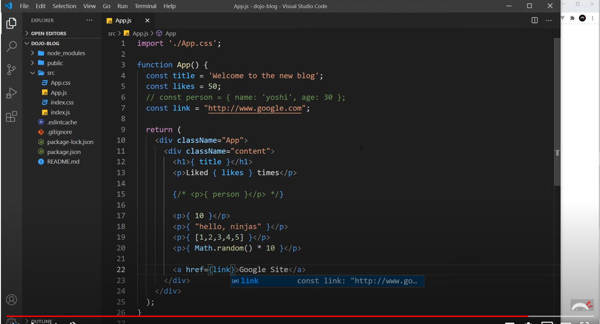

# react视频整理1前19个视频

youtube上找到的一个react视频学习： [戳戳](https://www.youtube.com/watch?v=aZGzwEjZrXc&list=PL4cUxeGkcC9gZD-Tvwfod2gaISzfRiP9d&index=21)


## 到目前为止个人理解的vue和react的区别

  

vue有属于自己的.vue组件  html css以及 javascript 都可以写在.vue文件里面

react使用 .js 以及 .css 文件， 并且使用 JSX 语法（虽然不是一定要使用JSX，但是react还是推荐使用JSX语法）


vue的数据以及函数、钩子函数 都声明在.vue文件中

react因为每个组件都是函数式组件 or class 类组件, 因此和每个组件相关的函数以及数据都写在组件的内部

etc

## react的动态数据

vue的数据双向绑定使用  两个大括号或者 v-text

react使用 {}, {}中可以放string, number ,array 但是不能放object。 {}中也可以直接写javascript语法

 


## Props & State 

props用来函数中传入的参数 可以理解为vue中的数据  但是props的数据不能修改，也就是只读不改

state声明的数据可以进行修改，但是不能够像vue一样直接对data部分进行赋值修改

需要使用setState进行修改（ES5）  或者使用useState进行修改（ES6）


## 父子组件之间的数据传递

这个部分和vue相似，都是在父组件标签上使用key-value的方式然后使用props进行传递

ex： BlogList.js 文件 和 Home.js文件 。  在Home.js文件中importBlogList.js文件


上面两种写法等效


也可以在组件内写javascript语句，比如filter


## 动态渲染 & 数据的双向绑定

承接上面的内容

大家都知道，如果想实现点击一个按钮，进行数据的删除（或者更新）的时候，需要创建一个函数。但是函数应该创建在哪里呢

因为props内容无法修改的特性，所以我们只能通过   调用创建useState时绑定的修改函数来修改。也就是Home.js中的setBlogs函数

我们可以在Home.js文件中创建一个函数 handleDelete，并且通过props的方法将这个handleDelete函数传递给BlogList.js组件。

 


## useState && useEffect

### useState

useState使用方法：第一个参数是变量名，第二个参数是赋值函数（用这个函数对函数所属的变量进行值的更新）

```javascript
import {useState} from 'react'

const Home = () => {
    //'mario' 这个地方的数据可以是string，number，object,array,boolean etc
    //name 是变量名， setName是修改变量名的函数（名字都可以自己设置）
    const [name, setName] = useState('mario')；
    const [age, setAge] = useState(25);
    
    const handleClick = () => {
        setName('luigi');
        setAge(30);
    }
    
    return(
     <div className="home">
        <h2>Homepage</h2>
        <p>{ name } is { age } years old</p>
		<button onClick={handleClick}>Click me </button>
    );
    
}

export default Home;
```

页面会从这个样子

 

变成这个样子


使用useState已经可以达到简单操作页面静态数据的方式了。但是还不够


### useEffect

useEffect可以用来监听state变量的变化，也可以在useEffect中进行数据的fetch，比如http请求就可以放在这个函数里面

#### basic

useEffect会在每一次页面进行render/re-render的时候被调用（也就是页面的数据被改变，布局发生变化，样式修改etc）

```javascript
useEffect(() => {
	console.log("render");
});
```

#### dependency

```javascript
//会在页面第一次渲染的时候调用，但是后面数据改变的时候不会再调用
useEffect(() => {
	console.log("render");
},[]);

//当第一次渲染 以及变量 name 数据发生改变的时候 被调用
useEffect(() => {
	console.log("render");
},[name]);
```

#### fetch data

使用json-server创建一个模拟的restful-api (细节在这里不说了)

  

#### TIPS

javascript一个true&false判断方法：  使用&&进行判断

```javascript
{blogs && <BlogList blogs={blogs} title="All blogs!" />}
//当blogs为true时，会调用&&后面的内容，当blogs为false的时候会忽略&&后面你的内容
//react中可以在{}中再嵌套{}
```


