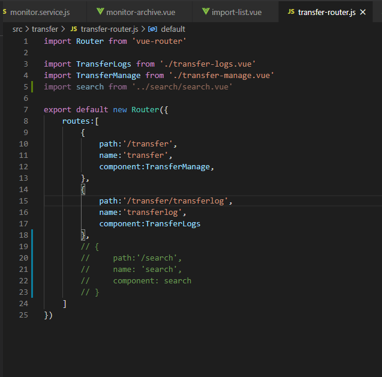
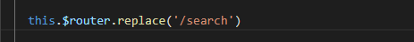

# vue中一级路由跳转另一一级路由

## 任务阐述

直接使用this.$router.replace或者 this.$router.push方法进行路由跳转的话会出现url改变了但是页面内容没有进行相应的渲染。


简单来看就是一个使用this.$router 进行路由跳转的功能。但是通常开发的时候，除了最外层的router外，每个模块内还可能会有一个模块的router。

### 在模块内的router下添加路径

比如我们在transfer模块下要实现点击跳转到search路由，需要在transfer-router.js文件中引用search模块（也就是search的一级页面）



然后使用this.$router.replace或者 this.$router.push进行页面跳转：




## 在最外层的router下添加路径

上面的这个方法会造成跨模块。有时候跨模块会导致维护不方便、牵一发而动全身，bug找不到出处的问题。所以如果不是transfer的子路由的话，比较推荐在最外层的router下改变路由。


我们直接在transfer的模块下引用最外层的router:

```
import Router from '../router/index.js'
```

然后直接对Router进行replace或者push操作：

```
Router.replace('/search')
```


就是介么简单

## TIPS

无论是最外层的router还是模块下的router，我们采用的操作router的方式都是引用vue-router然后新建一个vue-router对象。

在模块下开发的时候，默认的使用的vue-router对象是模块下的vue-router而不是最外层的vue-router，所以this.$router指的是自己模块的router而不是最外层的router,导致this.$router.replace('/search')只实现了url的变化而没有实现页面的渲染。

想要改变一级路由，最好的就是直接引用最外层router，然后进行push , replace操作