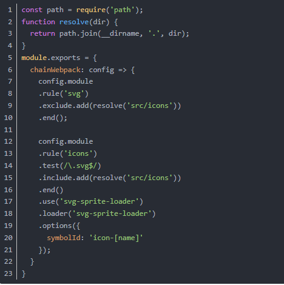
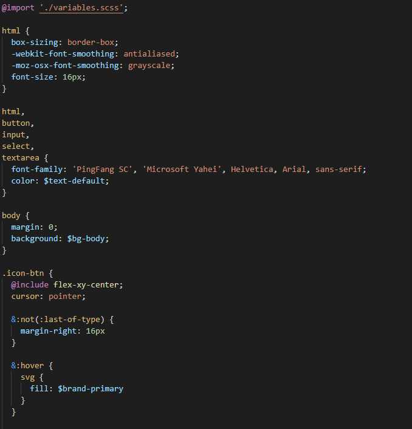

# vue中封装svg-icon组件以及使用方法

## 所需文件

在**component(创建项目后本身就存在)文件夹**下创建一个**svg-icon文件夹**，里面创建一个**svg-icon.vue** 的vue文件

svg-icon.vue文件代码：

```
<template>
  <svg
    class="svg-icon"
    :class="iconColorTheme"
    :style="{ height: iconUnit, width: iconUnit, fill: iconColor }"
    aria-hidden="true"
  >
    <use :xlink:href="iconName"></use>
  </svg>
</template>

<script>
export default {
  name: 'SvgIcon',
  props: {
    icon: {
      type: String
    },
    size: {
      type: String,
    },
    color: {
      type: String,
    },
  },
  data() {
    return {
      colorThemes: [
        'primary',
      ],
    };
  },
  computed: {
    iconName () {
      if (this.icon) {
        return `#${this.icon}`
      } 
      return '';
    },
    iconColor() {
      if (this.color) {
        if (!this.iconColorTheme) {
          return this.color;
        }
      } 
      return '';
    },
    iconColorTheme() {
      const matchTheme = this.colorThemes.indexOf(this.color) > -1;
      return matchTheme ? `svg-icon-${this.color}` : '';
    },
    iconUnit () {
      let unit;
      switch (this.size) {
        case 'xlg':
          unit = '24px';
          break;
        case 'lg':
          unit = '20px';
          break;
        case 'md':
          unit = '16px';
          break;
        case 'sm':
          unit = '12px';
          break;
        default:
          unit = this.size || '16px';
      }
      return unit;
    }
  }
}
</script>

<style lang="scss">
.svg-icon {
  width: 16px;
  height: 16px;
  fill: $icon-default;  //一个变量而已
  overflow: hidden;
}

</style>
```

新建一个模块名称为**svgIcons(名字可以修改)的文件夹**，里面有index.js文件 以及 **一个存放 .svg类型文件的文件夹**

index.js文件代码：

```javascript
import Vue from 'vue'
import SvgIcon from '@/components/SvgIcon' // svg组件
 
// register globally
Vue.component('svg-icon', SvgIcon)
 
const requireAll = requireContext => requireContext.keys().map(requireContext)
const req = require.context('./svg', false, /\.svg$/)
requireAll(req)
```


## 所需配置

### main.js需要添加配置

main.js中导入svgIcons文件夹（整体。包含index.js以及存放.svg类型文件的文件夹）

### 需要安装svg-sprite-loader

命令：npm install svg-sprite-loader --save

### vue.config.js中需要添加配置




第9，15行 的路径是存放.svg类型文件的文件夹的路径

第20行的symbolId可以更改，改为 **symbolId: '[name]'**

## 使用方法

```
<svg-icon class="title-icon" icon="import-manage" color="primary" size="xlg"></svg-icon>
//icon="文件名称" color="svg图片颜色" size="图片大小"
//切记要把Eslint这傻逼玩意关掉：在vue.config.js中添加 lintOnSave: false,
```

