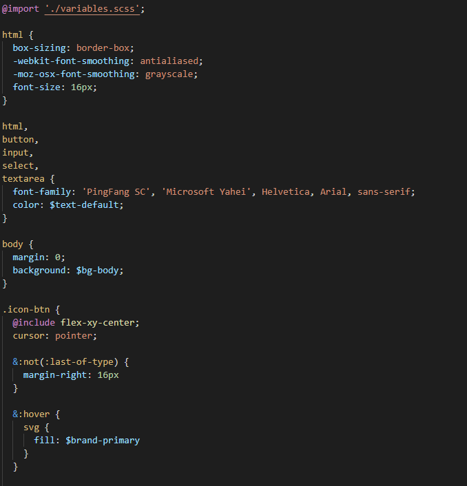

# vue项目创建之后的配置

在使用vue cli创建了vue项目并且进行了git代码管理之后，我们已经可以进行本地开发，进行静态页面的开发了。但是一个项目肯定不会只有静态页面（除非只是为了展示），我们还需要和后端进行数据交互，也就是接口以及字段的对接。

在进行接口的对接的时候，前端也需要配置，比如当**前后端主机不同时，需要使用代理，进行接口配置**。还有**前端如果要得到后端的数据时，需要发送请求，这就涉及到http请求配置**。本片博客在创建了本地开发的基础上进阶进行配置，使前端可以要到后端的数据。

## vue.config.js文件

### 什么是vue.config.js文件

vue.config.js是一个可选的配置文件，如果项目的根目录中(和package.json同级),存在这个文件，那么他会被@vue/cli-service自动加载。它用于存放一些针对@vue/cli的配置。

### vue.config.js文件常用配置

首先贴出vue-cli的官方配置文档：[vue-cli](https://cli.vuejs.org/zh/config/#%E5%85%A8%E5%B1%80-cli-%E9%85%8D%E7%BD%AE) (其实所有的配置并没有很多)

比较常用的(电子所项目用到)配置：

| devServer / devServer.proxy | 配置点后端API服务器请求代理 （很重要）proxy APIWEN           |
| --------------------------- | ------------------------------------------------------------ |
| **chainWebpack**            | **对内部的webpack配置进行更精细的修改 （重要）**             |
| **transpileDependencies**   | **默认情况下 `babel-loader` 会忽略所有 `node_modules` 中的文件。如果你想要通过 Babel 显式转译一个依赖，可以在这个选项中列出来。** |
| **lintOnSave**              | **设置时候每次保存时通过eslint进行代码lint (这玩意很烦人，最好设置成false)** |

proxy API 文档地址：[proxy API](https://github.com/chimurai/http-proxy-middleware#proxycontext-config) 

## 基于axios的http请求封装配置

在配置完了代理之后，我们的API服务器已经和后端连接了(详细地址还需要后端告诉你)

接下来就是配置http请求了，vue中使用axios配置http的方法另起了一篇博客，请参考这个博客：vue使用axios封装http请求

## 配置项目所需的样式

也许项目的样式组件你用的是element-ui或者vant，但是它们的组件也会有和自己的UI交互图不相符的时候，这时候就需要自己另启一个文件夹用来存放自己项目的样式：

- 在src下创建一个styles文件夹
- 更改global变量（html自带的基本标签）:
- 定义所有的基本变量： 
- 更改外用组件的底层变量： 
- 最后将这些所有的更改都在index.scss中进行导入，以便于外部调用：

（根据自己的实际情况进行修改）