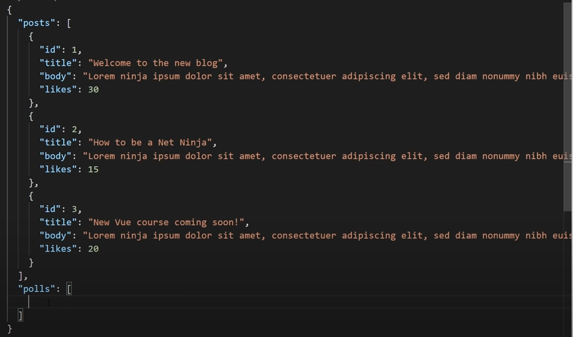
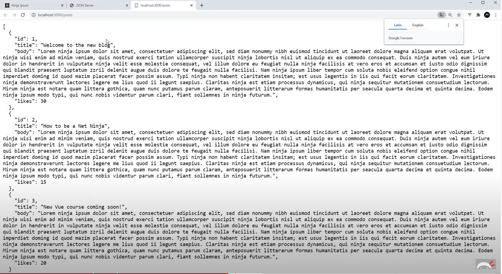
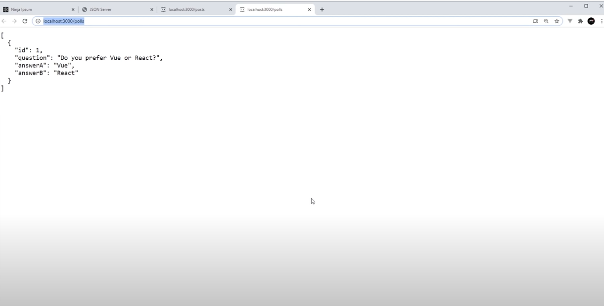

# 使用 JSON-server 发送 fake restful api


当你没有或者不想创建一个数据库和前端发送api请求的时候，可以使用json-server发送mock api请求

下载： `npm install -g json json-server` 

在vscode上下载 Live Server


json-server 的npm文档： [npm 文档](https://www.npmjs.com/package/json-server#getting-started)

json-server有属于自己的一套语法，比如排序，模糊查询，删除等的命令都是直接写在uri上的


## 基本配置

首先先创建本地json文件，将数据写入这个json文件

然后调用下面的命令启动这个文件

命令： `json-server --watch news.json --port 8000` 

news.json是自己文件的文件名   --port 8000是服务启动的端口号，可以自行修改（只要不冲突）


这个时候你可以使用 浏览器 或者 postman测试 这个接口

## 使用方法

仅在这里罗列一下常用到的业务逻辑，其余的在json-server的文档上查看并使用

根据这个视频来列举常用的逻辑：[ninja-json-server](https://www.youtube.com/watch?v=VF3TI4Pj_kM) 


### 将json文件和uri绑定 & get请求拿数据

json文件是这样的格式：

文件名是 db.json




当我们执行  `json-server --watch db.json` 命令后。因为json-server的逻辑所以他会有两个uri

一个uri是 http://localhost:3000/posts

另一个uri是 http://localhost:3000/polls

也就是说，json-server会读取.json文件的一级目录，然后将一级目录的名称作为端口号后面的router

当我们直接调用 http://localhost:3000/posts 的时候：

 


直接调用 http://localhost:3000/polls 的时候：




#### 根据id拿数据

```javascript
//在posts后面加入id（或者其他的参数）就可以实现单个查询
http://localhost:3000/posts/id
```


### 指定排序的参数&排序的方法

```javascript
//_sort用来设置排序的参数
//_order用来设置顺序还是倒序
let uri = 'http://localhost:3000/posts?_sort=likes&_order=desc'
```


### 删除数据

```javascript
//删除的时候调用拿数据的uri+primarykey（这里是id）
const res = await fetch('http://localhost:3000/posts/' + id, {
	method: 'DELETE'
})
```

### 添加数据

```javascript
const doc = {
	title: form.title.value,
	body: form.body.value,
    likes: 0
}

//添加数据的的时候调用的是get请求拿到数据的接口，只不过要配置method为post请求并且带上请求体
await fetch('http://localhost:3000/posts', {
	method: 'post',
	body: JSON.Stringify(doc)
	header: { 'Content-Type' : 'application/json' }
})
```


### full text搜索数据

```javascript
//q 是json-server用来执行查询逻辑的语法
let term = 'exercice';
let uri = 'http://localhost:3000/posts?_sort=likes&_order=desc&q=${term}';
```

