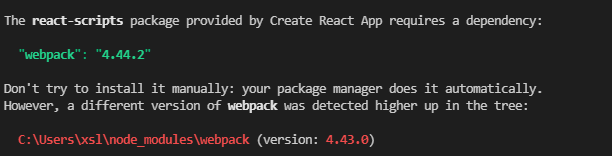
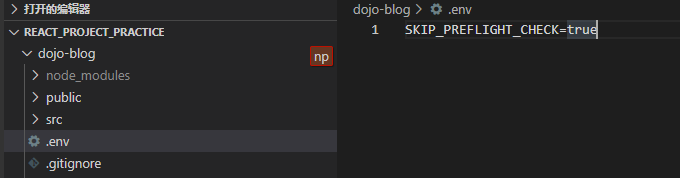

# 创建react项目以及遇到的问题

创建react项目的方法常见的有三种，详细内容请看这个网址：[戳戳](https://www.html.cn/qa/css3/14955.html)

在这里我们只讲使用 create-react-app 管理工具创建react项目

和vue项目相似，react也使用nodejs作为服务器，所以也是使用npm进行项目管理

在控制台中运行命令*npm install -g create-react-app*  下载create-react-app

 尝试运行npm run start 如果可以运行并且在3000端口下可以访问页面说明没有问题， 但是我遇到了webpack版本超前的问题

一个亲测有效的解决办法：在根目录下创建一个.env文件

并且在里面输入内容： SKIP_PREFLIGHT_CHECK=true 

然后再运行一次npm run start 项目就可以正常启动了

