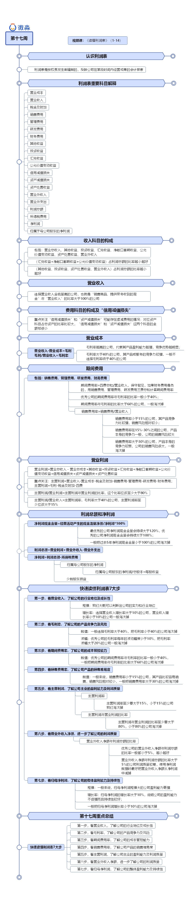

# 利润表

## 合并利润表中的重要科目

■ **营业收入**，通过销售活动在资产负债表中增加的现金、应收票据、应收账款。

■ **营业成本**，通过销售活动从资产负债表中转走的那些存货。

■ **税金及附加**，做生意交给政府的税。

■ **销售费用**，销售部门发生的人工成本、运费、广告费等。

■ 管理费用，管理部门发生的费用，几乎包括了销售费用、研发费用、财务费用之外的所有费用。

■ **研发费用**，研发部门发生的人工成本、原材料成本、折旧与摊销等。

■ **财务费用**，利息支出、利息收入、银行手续费等。

■ **其他收益**，与企业日常活动相关但不宜确认收入的政府补助。

■ **投资收益**，投资所获得的利润、利息、股息、价差收益，基本上是已实现的收益。

■ **汇兑收益**，外币业务因汇率变动折算成人民币时产生的收益。

■ **公允价值变动收益**，资产负债表中的交易性金融资产、投资性房地产账面价值的变动，是未实现的收益。

■ **信用减值损失**，资产负债表中的应收账款、合同资产、其他应收款、长期应收款等应收类的坏账损失以及债权投资、其他债权投资的减值损失。

■ **资产减值损失**，资产负债表中的存货、可供出售金融资产、持有至到期投资、长期股权投资、投资性房地产、固定资产、在建工程、无形资产、商誉等资产的减值损失。

■ **资产处置收益**，处置固定资产、无形资产发生的收益。

■ **营业外收入**，不是经营活动产生的收入，比如非经营相关的政府补助、债务重组利得、接受捐赠、罚款收入等。

■ **营业外支出**，不是经营活动产生的支出，比如债务重组损失、对外捐赠、罚款支出等。

■ **利润总额**，上市公司及其子公司共同的经营成果。

■ **所得税费用**，归属于政府的那部分经营成果，用利润总额乘以一定的税率得出。

■ **净利润**，归属于上市公司及其子公司全体股东的那部分经营成果。

■ **归属于母公司股东的净利润**，归属于上市公司股东的那部分经营成果。

## 利润表细节

