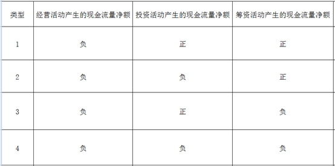
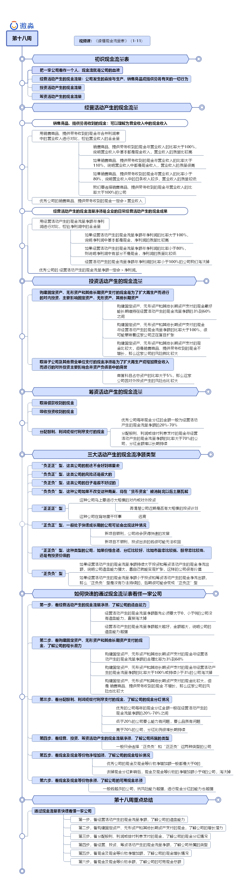

# 现金流量表

## 笔记

我们把经营、投资、筹资三大活动产生的现金流量净额联合起来看，从整体上去认识一家公司。

■ 三大活动产生的现金流净额都有正和负两种情况，我们把三大活动的正负现金流量净额进行排列组合，会出现8种不同的情况。

■ 我们先来看 经营活动产生的现金流量净额为负的四种情况。

■ 经营活动产生的现金流量净额为负，说明公司的主业经营亏损。一般情况下我们会直接淘汰掉这种类型的公司。大部分经营活动产生的现金流量净额为负的公司在5年内都会倒闭，虽然也有一些公司最终会大难不死变成很成功的公司。我们做投资追求的是大概率，强确定性，所以经营活动产生的现金流量净额为负的公司我们淘汰掉。

■ 虽然我们不投资 经营活动产生的现金流量净额 为负的公司，但是这几种组合我们还是要了解一下。

**〇 类型1：“负正正”型**

■ 公司经营活动产生的现金流量净额为负，说明公司主业经营亏损；投资活动产生的现金流量净额为正，说明公司在卖家当。筹资活动现金流量净额为正，说明公司在通过借钱或者股权融资筹钱。

■ 如果把这类公司看作生活中的一类人，这类人不好好工作，靠卖家里的东西或者借钱度日。这类人的前途基本是能预见到的，这类公司的前途也不会好到哪里去。

**〇 类型2：“负负正”型**

■ 公司经营活动产生的现金流量净额为负，说明公司主业经营亏损；投资活动产生的现金流量净额为负，说明公司还在继续投资。筹资活动现金流量净额为正，说明公司在通过借钱或者股权融资筹钱。

■ 公司主业不赚钱，而且公司还在通过借钱继续投资。如果是处于创业期的公司这也是正常现象，那重点就要通过公司的创始人、核心团队、商业模式等关键因素来分析公司的前景了。

■ 这种公司在美国的纳斯达克市场上还是很多的。不过在中国，创业期的公司是不能上市的，所以A股中这种类型的公司基本都是主业不行了，在尝试新项目的公司。这类公司的风险还是很大的。

**〇 类型3：“负正负”型**

■ 公司经营活动产生的现金流量净额为负，说明公司主业经营亏损；投资活动产生的现金流量净额为正，说明公司在卖家当。筹资活动现金流量净额为负，说明公司在还钱或分红，当然更可能的是在还钱，即使是分红也是不能持续的。

■ 这种公司主业亏钱，而且还要还钱，没办法只能卖家当。这样的公司日子是很不好过的。

**〇 类型4：“负负负”型**

■ 公司经营活动产生的现金流量净额为负，说明公司主业经营亏损；投资活动产生的现金流量净额为负，说明公司还在继续投资。筹资活动现金流量净额为负，说明公司在还钱或分红。

■ 公司所有的活动都在造成现金流出，这才是真正的“烧钱”。这种公司如果不改变这种局面，将在“货币资金”被消耗完以后土崩瓦解。不过这种公司在股市中其实并不多见。

我们看一下 经营活动产生的现金流量净额为正的四种情况

**〇 类型5：“正正正”型**

■ 公司经营活动产生的现金流量净额为正，说明公司主业经营赚钱；投资活动产生的现金流量净额为正，说明公司在卖家当或有投资收益。筹资活动现金流量净额为正，说明公司在通过借钱或者股权融资筹钱。

■ 公司三大活动都带来现金流入，这种公司看起来好像很好，但是有点反常。一家公司主业赚钱又不对外投资的公司为什么要筹集资金呢？

■ 这种公司要么是马上要进行大规模的对内或对外投资，要么就是在背地里干坏事。遇到这种类型的公司，我们一定要弄清楚公司近期是否有大规模的投资计划。如果没有，我们就可以认为这是一家在背地里干坏事的公司，还是远离比较好。

**〇 类型6：“正负正”型**

■ 公司经营活动产生的现金流量净额为正，说明公司主业经营赚钱；投资活动产生的现金流量净额为负，说明公司正在对内或对外投资。筹资活动现金流量净额为正，说明公司在通过借钱或者股权融资筹钱。

■ 这家公司把主业赚的钱都投到新项目中去了，但是还不够，于是公司通过融资来投资。一般处于快速成长期的公司可能会出现这种情况。如果新项目顺利，公司将会获得快速的发展；如果新项目不顺利，投资出去的钱很可能无法收回。

■ 这种类型的公司风险和机会并存。如果要投资这类公司，我们需要分析公司新项目的前景。如果不看好，还是远离比较好。

**〇 类型7：“正正负”型**

■ 公司经营活动产生的现金流量净额为正，说明公司主业经营赚钱；投资活动产生的现金流量净额为正，说明公司在卖家当或有投资收益。筹资活动现金流量净额为负，说明公司在还钱或分红。

■ 一般在经营活动产生的现金流量净额为正的情况下，公司卖家当的可能性还是比较小的，一般是投资收益。如果经营和投资带来的现金流入大于还债或分红带来的现金流出，公司的情况就是比较健康的。投资活动现金流净额为正，说明这种类型的公司已经不再扩张，这种类型的公司一般处于成熟期，能带来稳定的现金流。

■ 这种类型的公司，如果价格合适，分红比较好，比如市盈率比较低、股息率比较高，还是有投资价值的。

**〇 类型8：“正负负”型**

■ 公司经营活动产生的现金流量净额为正，说明公司主业经营赚钱；投资活动产生的现金流量净额为负，说明公司在继续投资，公司处于扩张之中。筹资活动现金流量净额为负，说明公司在还钱或分红。

■ 公司靠着主营业务赚的钱支持扩张的同时还在还钱或分红。如果经营活动产生的现金流量净额持续大于投资和筹资活动产生的现金净流出额，说明公司造血能力强大，靠自己就能实现扩张，这样的公司很有价值，你值得拥有。

■ 当然如果经营活动产生的现金流量净额小于投资和筹资活动产生的现金净流出额，那么“正负负”型是没有办法持续的，后期很可能会变成“正负正”型。

## 快速的通过现金流量表看懂一家公司

### **第一步，看经营活动产生的现金流量净额，了解公司的造血能力。**

■ 经营活动产生的现金流量净额反映公司的造血能力。

■ 经营活动产生的现金流量净额主要看两点，一是大小，二是增长率。

■ 经营活动产生的现金流量净额首先必须要大于0，小于0的公司没有造血能力，直接淘汰掉。主业亏损的公司，没有看的意义。其次经营活动产生的现金流量净额越大越好，金额越大，说明公司的造血能力越强。

■ 另外经营活动产生的现金流量净额的增长率要大于0，如果小于0则意味着公司的造血能力在下降，这预示着公司要走下坡路。

### **第二步，看购建固定资产、无形资产和其他长期资产支付的现金，了解公司的增长潜力。**

■ 购建固定资产、无形资产和其他长期资产支付的现金这个科目能反映公司未来的增长潜力。

■ 购建固定资产、无形资产和其他长期资产支付的现金主要看两点，一是与经营活动产生的现金流量净额的比率，二是能否带来销售商品、提供劳务收到的现金的增长。

■ 购建固定资产、无形资产和其他长期资产支付的现金与经营活动产生的现金流量净额的合理比率为3%到60%，这样的公司增长潜力较大并且风险相对较小。

###  **第三步，看分红率（也叫股利支付率），了解公司的现金分红情况。**

■ 优秀的公司每年的分红率一般在30%-70%之间。低于30%的公司要么能力有问题，要么品质有问题。高于70%的公司，分红比例很难长期持续。

### **第四步，看经营、投资、筹资活动产生的现金流量净额，了解公司所属的类型。**

■ 优秀的公司一般都是“正负负”和“正正负”型。封老师一般只会选择“正负负”和“正正负”这两种类型的公司。

###  **第五步，看现金及现金等价物净增加额，了解公司的现金增长情况。**

■ 现金及现金等价物净增加额主要看正负。现金及现金等价物净增加额大于0，公司才能积累更多的钱。公司所属的“正负负”或“正正负”类型才能持续的保持。

■ 优秀公司的现金及现金等价物净增加额一般都是大于0的。如果小于0要加回现金分红，加回现金分红后，现金及现金等价物的净增加额小于0的公司，淘汰掉。

### **第六步，看现金及现金等价物余额，了解公司的可用现金总额。**

■ 现金及现金等价物余额反映公司手里有多少钱可以用。一般钱越多的公司，抗风险能力越强，进行现金分红的能力也越强。

## 图片总结

