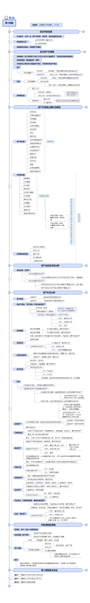
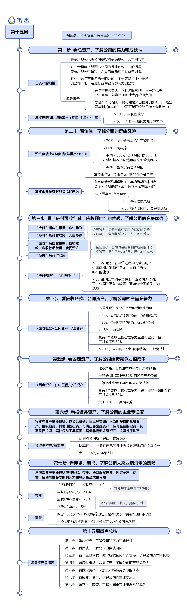
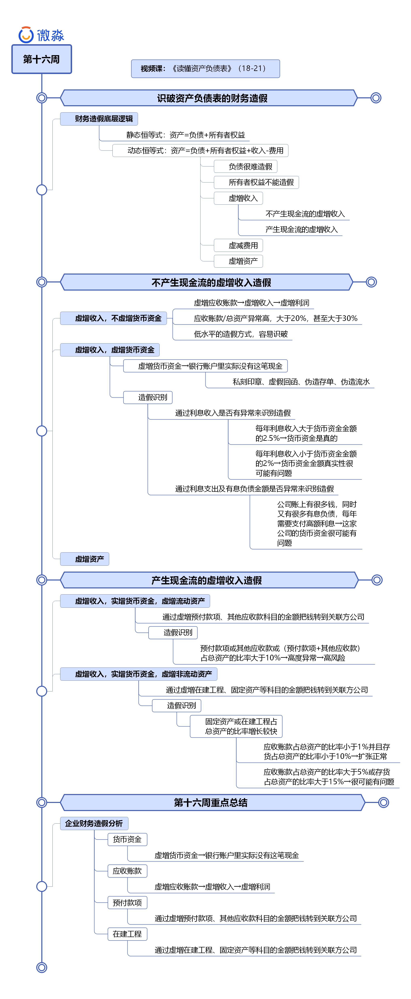

# 财务报告-资产负债表

资产负债表隶属于**财务报告**的一部分

我们可以在目录中找到  财务报告  然后直达

可以看到财务报告由资产负债表， 利润表， 现金流量表，所有者权益变动表和财务报表附注，也就是四表一注所构成。

四张报表中，所有者权益变动表只是对股东权益增减变化的客观记录和描述，是无法造假的，也是没有必要造假的，一般情况下我们也不用去分析。

资产负债表反映的是一家公司在某个时点上可以以货币计量的资产、负债及所有者权益情况。资产负债表就像是一张照片，它反映的只是那一瞬间的信息。

另外资产负债表只反映了一家公司可以用货币计量的资产情况，并没有反映所有的资产情况。比如，一家公司优秀的企业文化、口碑都是非常重要的无形资产，但是这些资产因为无法用货币计量，所以不反映在资产负债表上。

## 资产负债表科目

### 资产类科目（资产类专有名词）

■钱放在公司银行账户里，就是**货币资金**。

■ 钱买了债券、股票、基金并且打算一年内卖出，就是**交易性金融资产**。

■ 钱没收到，客户给了张汇票就把货拉走了，就是**应收票据**。

■ 钱没收到，客户给了张欠条就把货拉走了，就是**应收账款**。

■ 钱不够用，公司把银行承兑票据贴现，就是**应收款项融资**。

■ 钱付了还没收到货，就是**预付款项**。

■ 钱变成了公司的原材料或商品，就是**存货**。

■ 钱买了债券赚利息，就是**债权投资**。

■ 钱投到了其他公司并能影响其经营，就是**长期股权投资**。

■ 钱投资了房地产，就是**投资性房地产**。

■ 钱变成了厂房、设备，就是**固定资产**。

■ 钱用于在建厂房、生产线，就是**在建工程**。

■ 钱用于研发并有成果，就是**无形资产**。

■ 钱用于溢价收购其他公司，溢价金额，就是**商誉**。

■ 钱已经花掉，但需要1年以上时间摊销，就是**长期待摊费用**。

■ 钱缴税缴多了，多缴的金额，就是**递延所得税资产**。

### 负债类科目（负债类专有名词）

■ 钱是借来的，1年内要还，就是**短期借款**。

■ 钱没付，开了张汇票就把货拉来了，就是**应付票据**。

■ 钱没付，开了张欠条就把货拉来了，就是**应付账款**。

■ 钱收了还没发货，就是**预收款项**。

■ 钱是员工的工资奖金，暂时还没发放，就是**应付职工薪酬**。

■ 钱是要缴的税，暂时还没有缴，就是**应交税费**。

■ 钱还没有付，并且钱和公司的主营业务没有直接关系，就是**其他应付款**。

■ 钱是借来的，1年内不用还，就是**长期借款**。

■ 钱是发债借来的，1年内不用还，就是**应付债券**。

■ 钱来自政府补贴需要在未来确认收益，就是**递延收益**。

■ 钱缴税没缴够，少缴的金额，就是**递延所得税负债**。

### 所有者权益科目（所有者权益专有名词）

■ 钱是股东按股本投入的，就是**实收资本(或股本)**。

■ 钱是股东投的，超出实收资本的部分，就是**资本公积**。

■ 钱是公司经营赚来的，公司从净利润中提取部分用于发展，就是**盈余公积**。

■ 钱是公司经营赚来的，公司可以用来分配给股东的净利润，就是**未分配利润**。

■ 钱变成的总资产减去总负债后的差额归属于上市公司所有股东的部分，就是**归属于母公司所有者权益合计**。

■ 钱变成的总资产减去总负债后的差额归属于子公司所有小股东的部分，就是**少数股东权益**。

## 举例描述各个专有名词

■ 小黑创办了一家工厂A，投资了100万元，此时，A的资产负债表中所有者权益项下的“实收资本”科目金额变为100万元，表示小黑入资了100万元。另外A的资产负债表中资产项下的“货币资金”科目金额变为100万元，表示小黑入资的100万元在A的银行账户里，A的资产负债表中总资产金额也变为100万元。

■ 小黑建厂房买设备花了90万，此时A的资产负债表中资产项下的“固定资产”科目金额变为90万，表示固定资产的价值为90万。同时，“货币资金”科目金额减少90万，变为10万，表示只剩下10万元现金啦。

■ 小黑发现工厂要正常运营还需要再投入50万元资金，但是小黑自己已经没有钱了，拿不出50万。于是他把厂房和设备抵押给银行贷了50万元，贷款期限为3年。此时A的资产负债表中负债项下的“长期借款”科目金额变为50万元，表示A借款了50万元。此时A的资产负债表中“货币资金”科目金额增加50万，变为60万元，总负债金额变为50万，总资产金额变为150万，所有者权益金额为100万。所有者权益等于总资产减去总负债。

■ 小黑招聘生产工人花了10万，买原材料花了30万，然后生产出了第一批产品。此时A的资产负债表中资产项下“存货”科目金额变为40万，表示生产的商品成本价为40万。“货币资金”科目金额减少40万，变为20万。

■ 产品生产出来以后，由于还没有品牌影响力，比较难卖。小黑靠自己的销售能力卖掉了10万元的存货，收到20万的现金收入。此时A的资产负债表中资产项下“存货”科目金额变为30万，表示卖掉了成本价为10万元的产品。“货币资金”科目金额增加20万，变为40万。此时A的资产负债表中“货币资金”科目金额变为40万元，总负债金额变为50万，总资产金额变为160万，所有者权益金额为110万。

■ 为了打开销路，小黑想了一个办法，他给经销商制定了先货后款的销售策略，经销商可以先把货拉走去卖，3个月后再付钱。于是产品销量大增，成本价为30万元的产品很快卖完了，卖了60万元，但是小黑没有收到现金，小黑只是签了60万的销售合同。此时A的资产负债表资产项中“存货”科目金额变为0，表示产品都卖掉了。“应收账款”科目金额变为60万，表示有60万的欠款未来需要收回。

■ 另外小黑两次共卖掉了40万的存货，产生了80万的收入，未来还需要给税务局缴2万元的税，A的资产负债表中“应交税费”科目金额变为2万元。此时A的资产负债表中货币资金金额为40万，应收账款为60万，存货金额为0，固定资产金额为90万，总资产金额变为190万，总负债金额变为52万，所有者权益金额变为138万，其中“实收资本”金额为100万，“未分配利润”为38万。

## 资产负债表分析步骤

### 读懂资产负债表

#### **第一步** **看总资产，了解公司的实力和成长性**

〇 **总资产我们重点看两点：一是总资产的规模；二是总资产的同比增长率。**

■ 一家公司的总资产规模代表这家公司掌控的资源规模，也就是这家公司的实力。

■ 通过一家公司的总资产规模，在一定程度上能看出这家公司在行业中的地位。

■ 某个行业中总资产排名第一的公司，虽然不一定就是这个行业中最好的公司，但一定是这个行业中很有影响力的公司**。**

■ **一般情况下，总资产规模排名第一的公司就是这个行业中的老大。**

■ 另外总资产同比增长率大于10%的公司一般处于扩张之中，这样的公司成长性较好。

■ 如果一家公司的总资产同比负增长，那么这家公司很可能处于收缩或者衰退之中。

#### **第二步，看负债，了解公司的偿债风险**

 〇负债重点看两点，**一是资产负债率，二是准货币资金减有息负债的差额。**

■ 从这两个方面我们可以判断出公司的偿债风险。

■ **资产负债率****=****总负债****/****总资产*****100%**。

■ 资产负债率等于70%为警戒线，如果一家公司的资产负债率大于70%，这家公司发生债务危机的可能性就会变大。

■ **在投资实践中一般会把资产负债率大于60%的公司淘汰掉。**资产负债率小于40%的公司，基本没有偿债风险。资产负债率大于40%小于60%的公司，偿债风险比较小，但在特殊情况下依然可能发生偿债危机。

■ 为了排除这类公司的偿债风险，我们需要看一下准货币资金减有息负债的差额是否大于0？如果大于0，公司没有偿债风险；如果小于0，公司依然有偿债风险，最好淘汰掉。

■ **准货币资金=货币资金+交易性金融资产**

■ **有息负债**=**短期借款＋一年内到期的非流动负债＋长期借款＋应付债券＋长期应付款**

#### **第三步，看“应付预收”减“应收预付”的差额，了解公司的竞争优势。**

■ “应付”指应付票据、应付账款；“预收”指预收款项、合同负债。合同负债是2019年财报中新出现的一个科目，和预收款项很像，可以看作预收款项。

■ “应收”指应收票据、应收账款、应收款项融资、合同资产；“预付”指预付款项。应收款项融资、合同资产是2019年财报中新出现的科目，应收款项融资可以看作银行承兑票据，合同资产可以看作应收账款。

■ 应收票据、应收账款、应收款项融资、合同资产、预付款项的金额越小，代表公司对经销商和供应商的话语权越强，竞争优势越明显，行业地位越高。

■ 应付票据、应付账款、预收款项、合同负债的金额越大，代表公司对供应商和经销商的话语权越强，竞争优势越明显，行业地位越高。

■ “应付预收”减去“应收预付”的差额大于0，说明公司在经营过程中无偿占用了供应商和经销商的资金，具有“两头吃”的能力。

■ 这相当于上下游公司为公司提供了无息贷款，差额越大说明公司的竞争力越强。

■ 没有公司会心甘情愿的让其他公司无偿占用自己的资金，为什么上下游公司愿意让公司无偿占用自己的资金呢？一定是公司具备某种竞争优势。

■ “应付预收”减去“应收预付”的差额小于0，说明公司的资金被上下游公司无偿占用了，公司的竞争力较弱，竞争优势不明显。

■ 在投资实践中，我们一般会把**（应付票据+应付账款+预收款项+合同负债）-（应收票据+应收账款+应收款项融资+预付款项+合同资产）小于0的公司淘汰掉。**

#### **第四步，看应收账款、合同资产，了解公司的产品竞争力。**

■ 应收账款、合同资产主要看占总资产的比率，最好的公司**（应收账款+合同资产）占总资产的比率**小于1%，优秀的公司一般小于3%。

■ 好公司的品牌影响力强，产品一般都很畅销，要想买好公司的产品往往需要一手交钱一手交货，有时甚至需要先付钱过一段时间才能收到货，所以最好的公司基本没有应收账款。

■ 应收账款多的公司，其品牌影响力往往较弱，产品竞争力不行。

■ 公司靠品牌或产品自身的影响力很难有好的销量，所以公司迫不得已才会采取先交货后收钱的销售方式。

■ （**应收账款+合同资产）占总资产的比率本质反映的是公司产品的销售难易度。**

■ （应收账款+合同资产）占总资产的比率小于1%，表明公司的产品很畅销；

■ 小于3%，表明公司的产品畅销；

■ 大于10%，表明公司的产品比较难销售；

■ 大于20%，表明公司的产品很难销售。

■ 在投资实践中，我们一般会**把（应收账款+合同资产）占总资产的比率大于15%的公司淘汰掉**。

■ 在特别情况下，对于行业第一名并且同时具有3个或以上核心竞争力的公司可以放宽到20%，大于20%的一律淘汰掉。

#### **第五步，看固定资产，了解公司维持竞争力的成本**

■ 固定资产主要看**（固定资产+在建工程）占总资产的比率**，比率越高说明公司维持竞争力的成本越高。

■ 由于固定资产会变旧，公司为了保持竞争力就需要持续不断的在固定资产上进行大量投入。

■ 这样会影响公司的自由现金流，自然也会影响股东的分红。

■ 另外如果市场环境发生变化，已经投入的固定资产很难退出，这样就增大了公司的风险。

■ 在投资实践中，一般选择（固定资产+在建工程）与总资产比率小于20% 的轻资产型公司，一般会**把（固定资产+在建工程）与总资产比率大于40%的公司淘汰掉**。

■ 在特别情况下，对于行业第一名并且同时具有3个或以上核心竞争力的公司可以放宽到50%，大于50%的一律淘汰掉。

#### **第六步，看投资类资产，了解公司的主业专注度。**

■ 投资类资产主要包括：以公允价值计量且其变动计入当期损益的金融资产、债权投资、其他债权投资、可供出售金融资产、持有至到期投资、长期股权投资、其他权益工具投资、其他非流动金融资产、投资性房地产。

■ 投资类资产我们主要看**投资类资产占总资产的比率**。

■ **优秀的公司一定是专注于主业的公司，与主业无关的投资类资产占总资产的比率应当很低才对，最好为0**。

■ 如果某公司投资类资产占总资产的比率较大，就意味着这家公司在自己的行业内已经很难发现好的投资机会了。

■ **在投资实践中，一般会把投资类资产占总资产比率大于10%的公司淘汰掉。**

#### **第七步，看存货、商誉，了解公司未来业绩爆雷的风险。**

■ 易爆雷资产主要包括应收账款、存货、长期股权投资、固定资产、商誉，这五个科目是最容易埋雷的地方，后期爆雷的时候会导致利润大幅减少甚至大幅亏损。由于我们在前六步中已经看过了应收账款、固定资产、长期股权投资科目，排除了这三个科目爆雷的风险。

〇 这里重点看一下存货和商誉。

■ 对于“**应付预收”减“应收预付”差额大于0并且应收账款占总资产比率小于1%**的公司来说，存货基本没有爆雷的风险。

■ 对于应收账款占总资产的比率大于5%并且存货占总资产的比率大于15%的公司，爆雷的风险比较大，需要淘汰掉。

##### 商誉暴雷

■ 商誉是公司对外收购所花的超出被收购公司净资产的那部分钱。

■ 收购来的公司企业文化不同，甚至行业也不同，很难经营成功，所以商誉是最容易爆雷的科目之一。

■ 在所有爆雷科目中商誉一直都是那个最耀眼的明星，堪称爆雷科目中的雷神。

■ 在A股的业绩爆雷案例中，10个爆雷的有5个来自商誉，1个来自应收账款，1个来自存货，1个来自长期股权投资，1个来自固定资产，还有1个来自其他所有可能爆雷的资产科目。

■ 可见商誉在爆雷界的地位如此巩固，未来也很难被超越。

■ 在投资实践中，一般会把商誉占总资产的比率超过10%的公司淘汰掉。

## 资产负债表财务造假

这一部分不细说。我觉得看图就了解一下就够了

